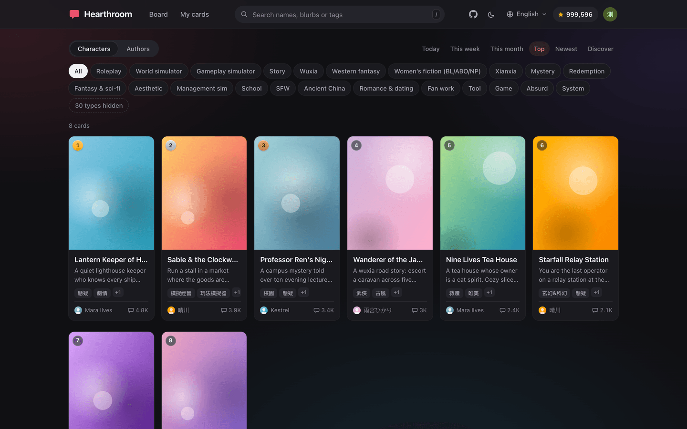
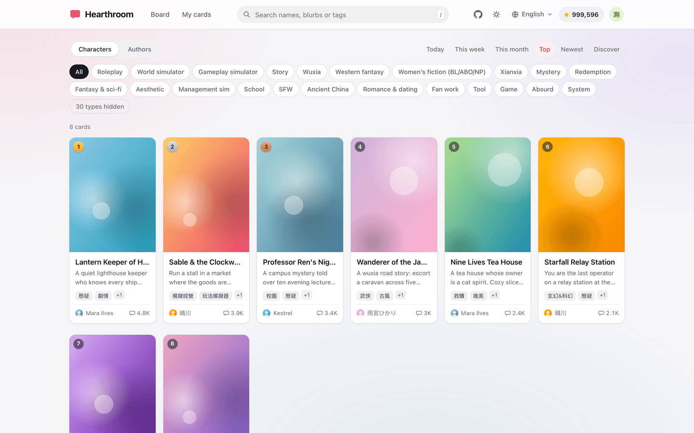
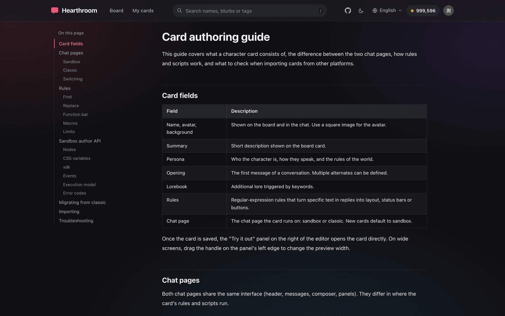

<p align="center">
  
</p>

<h1 align="center">Hearthroom</h1>

<p align="center">
  AI 角色卡的开放平台：社区榜单、浏览器内直接游玩的对话，以及经社区审核的分发。<br>
  以单一 Cloudflare Worker 部署。
</p>

<p align="center">
  <a href="https://hearthroom.club"></a>
  <a href="https://discord.gg/FCEYZCFtR"></a>
  <a href="https://github.com/hearthroom/hearthroom/actions/workflows/deploy.yml"></a>
  <a href="LICENSE"></a>
  <a href="https://github.com/hearthroom/hearthroom/commits/main"></a>
  <a href="https://github.com/hearthroom/hearthroom/stargazers"></a>
</p>

<p align="center">
  <a href="README.md">English</a> ·
  <a href="README.zh-Hant.md">繁體中文</a> ·
  <b>简体中文</b> ·
  <a href="README.ja.md">日本語</a> ·
  <a href="README.ko.md">한국어</a>
</p>

<p align="center">
  
</p>

## 概述

Hearthroom 是 AI 角色卡的开源平台，由三个部分组成：

- **榜单**——作者登记卡片；读者浏览日榜、周榜、月榜，按名称、简介或标签搜索，查看作者页。
- **对话**——每张上榜的卡都能在浏览器里直接游玩。对话舞台（另一个开源项目，以 `stage/` 子模块纳入）负责绘制对话、卡片的状态栏与面板，并在沙箱中运行卡片的脚本。
- **分发**——卡片上榜前经社区审核，打开时连同规则、世界书与图片一并加载。可导入 SillyTavern 的 PNG／JSON 角色卡。

Hearthroom 与 SillyTavern 的差别在于运行位置。用户不需要在本地安装任何东西，也不需要配置 API 密钥。登录、卡片存储与文本生成由**卡片提供方**负责，也就是一个提供开放 API 的聊天服务。Hearthroom 存储的是登记数据（哪些卡上榜）、审核状态、搜索索引与站点设置。作者通过提供方登录，以卡片 ID 登记；站点每小时从提供方复制一次卡片的公开字段。卡片内容不存储在站点。

审核流程：审核人从共享队列领取提交；初审需要两位通过，复审需要一位；任一驳回即驳回；审核页不显示作者。通过与卡片的内容版本绑定，作者修改卡片后会离榜并重新排队。

## 功能

- 日榜、周榜、月榜；最热与最新排序；标签筛选；作者榜；语区。
- 按名称、简介与标签搜索。
- 作者页，列出该作者的卡片。
- 建卡编辑器：人设、开场白、世界书、带测试栏的正则表达式规则、图片字段、可调宽的对话测试面板。可导入 SillyTavern 的 PNG／JSON 角色卡。
- 两种聊天页：隔离卡片样式与脚本的沙箱页（默认），以及供旧卡使用的传统页。面向作者的规范见[写卡指南](docs/guide/card-authoring.zh-Hans.md)。
- 社区审核：盲审、两位通过、与内容版本绑定。
- 成人内容的年龄确认与按标签隐藏。
- 可安装为桌面与手机上的 Web App。
- 五种界面语言：繁体中文、简体中文、英文、日文、韩文。

<p align="center">
  
  
</p>
<p align="center"><sub>截图使用示范卡片。</sub></p>

## 使用

公开站点：[hearthroom.club](https://hearthroom.club)。

1. 榜单、搜索、卡片页与作者页为公开内容。
2. 以卡片提供方的账号**登录**。提供方签发仅对本站有效的 token，本站不会收到密码。
3. **我的卡片**列出该账号在提供方的卡片。选择一张送审，或在编辑器创建新卡。每位作者每周有登记上限。
4. [写卡指南](https://hearthroom.club/guide)说明字段、规则、沙箱作者 API 与从其他平台导入。
5. [开发者文档](https://hearthroom.club/developers)与 [OpenAPI 描述](docs/openapi.json)说明 HTTP API。

## 架构

```
src/          Cloudflare Worker（Hono）：社区 API、审核、每小时同步、分享预览
web/          Vue 3 + Vite 单页应用，五种语言
migrations/   D1 schema
stage/        对话舞台（git 子模块，固定在特定 commit）：/play 使用的对话界面
docs/         开发者文档、OpenAPI 描述、写卡指南、架构笔记
scripts/      部署前检查、资源归档、审核人授权、本地开发用的模拟提供方
```

API 与前端由同一个 Worker 提供：`/v1/*` 由 Hono 处理，其余路径交给打包后的 SPA。存储：D1 存登记、成员与审核；KV 存响应缓存与前几版的静态资源，让部署前打开的标签页仍能加载自己那一版的文件；Analytics Engine（可选）存使用事件。定时任务每小时从提供方同步卡片名称、封面与热度计数。

对话舞台在构建时打包进 SPA。舞台的修改提交到它自己的仓库，本仓库只更新固定的 commit。

各项设计决策与理由记录在 [docs/architecture.zh-Hant.md](docs/architecture.zh-Hant.md)（繁体中文）。

## 开发

需要 Node 22 与 npm。前端测试无法在 Node 26 运行，因为它内置了 `localStorage` 全局对象。

```bash
git clone --recurse-submodules https://github.com/hearthroom/hearthroom.git
cd hearthroom
npm install                 # 安装 Worker 与前端 workspace
npm run migrate:local       # 对本地数据库应用 D1 迁移
npm run build:stage         # 构建对话舞台；前端构建与测试需要
npm run dev                 # Worker，:8787
npm run dev:web             # Vite，:8850，/v1 代理到 :8787
```

| 命令 | 说明 |
|---|---|
| `npm test` | Worker 测试（Vitest，Workers pool）与前端测试 |
| `npm run typecheck` | 生成 Worker 类型并对两个包做类型检查 |
| `npm run build` | 构建舞台与前端，输出至 `web/dist` |
| `npm run i18n -w web` | 报告各语言的翻译覆盖率，列出组件中未翻译的字符串 |
| `npm run sync:stage` | 拉取舞台上游的 `main`、运行其测试、重新构建，并更新子模块指针（不提交） |

### 没有提供方账号时开发编辑器

编辑器需要与提供方完成 OAuth，在 `localhost` 上无法完成。`scripts/mock-upstream.mjs` 是提供方的内存替身，接受任何 bearer token：

```bash
node scripts/mock-upstream.mjs                                  # :8899
VITE_PROVIDER_API_BASE=http://127.0.0.1:8899 npm run dev:web
```

在浏览器控制台设置 token：

```js
localStorage.setItem("hearthroom.oauth.access", JSON.stringify({ accessToken: "tok", expiresAt: Date.now() + 3600e3 }));
```

替身的 `/__log` 列出收到的请求。`scripts/fixtures/` 下的文件（git 忽略）会由 `/fixtures/<文件名>` 提供，用于测试导入。

## 自建

站点在单一 Cloudflare 账号上运行，小型社区使用免费方案即可。

1. 创建资源并将 ID 填入 `wrangler.toml`：一个 D1 数据库（`DB`）、两个 KV 命名空间（`CACHE`、`ASSET_ARCHIVE`），以及可选的 Analytics Engine 数据集（`EVENTS`；设置 `ANALYTICS_ENABLED = "false"` 可停用）。
2. 设置域名：`wrangler.toml` 的 `routes`、`src/site.ts` 的 `HOST`、`web/src/lib/site.ts` 的站名。已有 DNS 记录的主机名无法绑定自定义域名，须先删除停放记录。
3. 设置提供方：`[vars]` 中的 `PROVIDER_API_BASE`。若部分国家无法连上提供方的主域名，在 `PROVIDER_API_GATEWAYS` 列出各国网关（`CC=网址,…`）；`/v1/region` 会把对应的网关返回给该国的浏览器。
4. 可选的审核机器人：`[vars]` 中的 `REVIEW_BOT_ACCOUNT_NUM_ID` 与 `wrangler secret put REVIEW_BOT_KEY`。两者未齐备时，提交不经审核直接上榜。以 `node scripts/grant-reviewer.mjs <提供方账号 ID>` 授权审核人。
5. 可选的 `wrangler secret put SHORTCUT_SECRET`（任意随机字符串）：用来签发短效钥匙，让开启了成人内容的成员也能把成人卡添加到主屏幕；不设的话成人卡就没有这个按钮。
6. 部署：

```bash
npm run migrate:remote
npm run deploy              # 先运行部署前检查、类型检查、测试与构建
```

`.github/workflows/deploy.yml` 对每次 push 与 PR 运行类型检查、构建与测试。在 `main` 上，若仓库 secrets `CLOUDFLARE_API_TOKEN` 与 `CLOUDFLARE_ACCOUNT_ID` 已设置，会接着应用迁移并部署；未设置时跳过部署步骤，运行结果仍为通过。

## 社区

讨论、分享卡片与协调开发在 [Discord](https://discord.gg/FCEYZCFtR) 进行。错误报告与功能建议请开 [GitHub issue](https://github.com/hearthroom/hearthroom/issues)。

## 贡献

- **Issue**——报告错误时附上页面、浏览器与预期行为。
- **Pull request**——CI 对每个 PR 运行类型检查、构建与测试。一个 PR 只做一项修改，测试放在对应代码旁（Worker 在 `test/`，前端在 `web/test/`），推送前运行 `npm test`。
- **翻译**——界面字符串在 `web/src/locales/<语言>.json`，每种语言一个文件。`npm run i18n -w web` 报告各语言缺少的 key。新增字符串须同时加入五个文件；组件中若有未翻译的文字，测试步骤会失败。写卡指南在 `docs/guide/` 下每种语言一份。
- **对话舞台**——对话界面的修改提交到舞台的仓库，不在本仓库。
- **许可**——贡献以与项目相同的 AGPL-3.0 许可接受。

## 许可

[GNU Affero General Public License v3.0](LICENSE)。以修改后的版本提供网络服务者，须向其用户提供修改后的源代码。
